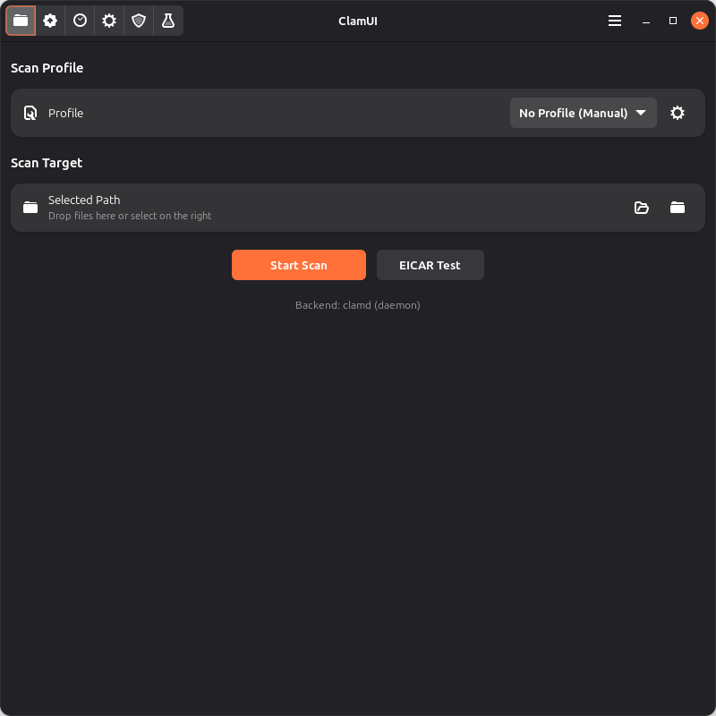
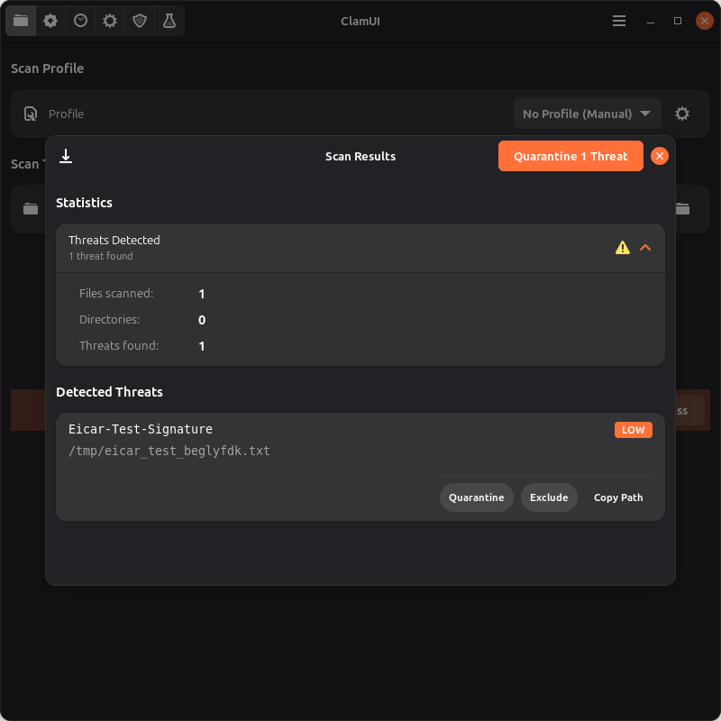
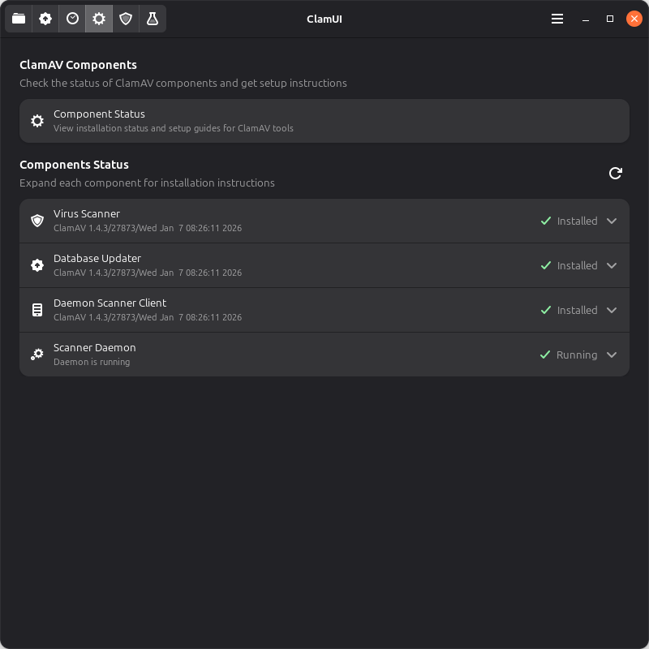
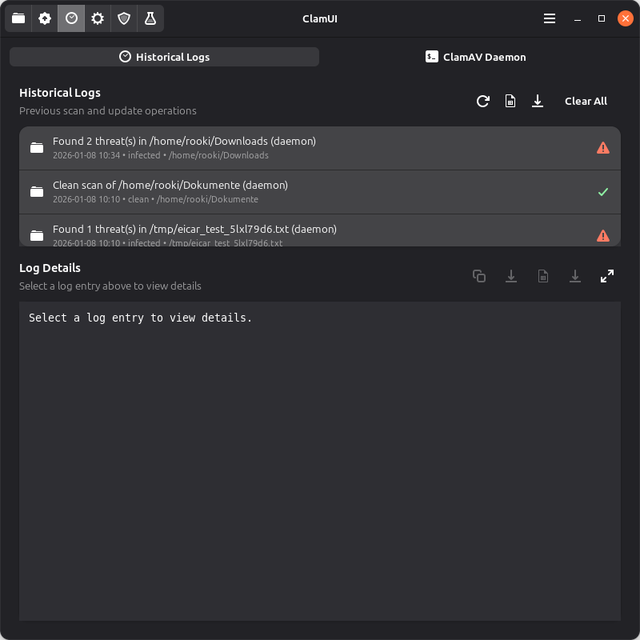

<div align="center">


# ClamUI

<p align="center">
  <strong>A modern Linux desktop application for ClamAV antivirus</strong>
</p>

<p align="center">
  <a href="LICENSE"></a>
  <a href="#"></a>
  <a href="https://flathub.org/en/apps/io.github.linx_systems.ClamUI"></a>
</p>

<p align="center">
  Built with <strong>PyGObject</strong>, <strong>GTK4</strong>, and <strong>Adwaita</strong> for a native GNOME appearance
</p>

<p align="center">
  <a href="#features">Features</a> •
  <a href="#screenshots">Screenshots</a> •
  <a href="#quick-start">Installation</a> •
  <a href="#documentation">Documentation</a>
</p>

<br>



</div>

<br>

---

## Features

ClamUI provides a comprehensive set of features designed to make antivirus protection on Linux both powerful and user-friendly.

<table>
<tr>
<td width="50%" valign="top">

### Scanning & Protection

- **Easy File Scanning** — Native GTK4 file dialogs for intuitive file selection
- **Async Scanning** — Background processing keeps the UI responsive during scans
- **Quarantine Management** — Safely isolate and manage detected threats
- **Scan Profiles** — Create custom configurations for different use cases

</td>
<td width="50%" valign="top">

### Management & Integration

- **Scan History** — Track and review all past scan results
- **Statistics Dashboard** — Monitor scanning activity and threat detections
- **VirusTotal Integration** — Optional enhanced threat analysis via API
- **File Manager Integration** — Right-click "Scan with ClamUI" in Nautilus, Dolphin, and Nemo

</td>
</tr>
<tr>
<td width="50%" valign="top">

### User Experience

- **Modern UI** — Native Adwaita styling with proper GNOME integration
- **System Tray** — Quick access with actions and real-time scan progress
- **Desktop Notifications** — Stay informed of scan results and updates

</td>
<td width="50%" valign="top">

### Flexibility

- **Multiple Scan Backends** — Choose between daemon (clamd) or direct (clamscan)
- **Scheduled Scans** — Configure automatic scanning with systemd or cron
- **Customizable Settings** — Extensive configuration options for your workflow

</td>
</tr>
</table>

---

## Screenshots

<div align="center">

| Scan Results | Quarantine Management |
|:------------:|:---------------------:|
|  |  |

| ClamAV Components Status | Scan History |
|:------------------------:|:------------:|
|  |  |

| Scan Profiles | Settings |
|:-------------:|:--------:|
|  |  |

</div>

---

## Quick Start

### Flatpak (Recommended)

```bash
flatpak install flathub io.github.linx_systems.ClamUI
flatpak run io.github.linx_systems.ClamUI
```

### From Source

```bash
git clone https://github.com/linx-systems/clamui.git
cd clamui
uv sync
uv run clamui
```

> **More Installation Options:** See the [Installation Guide](./docs/INSTALL.md) for .deb packages and system-wide installation

---

## Usage

### GUI Application

1. Launch ClamUI from your application menu or terminal
2. Select a file or folder to scan
3. Click "Scan" to start the antivirus scan
4. View results and take action on any threats detected

### Command Line

```bash
# Launch the application
clamui

# Scan specific files directly
clamui /path/to/file1 /path/to/folder
```

> **Detailed Instructions:** See the [User Guide](./docs/USER_GUIDE.md)

---

## Configuration

ClamUI stores user preferences and can be configured through the Preferences dialog or by editing the configuration file directly.

**Configuration Location:** `~/.config/clamui/settings.json`

### Key Configuration Options

<table>
<tr>
<th width="25%">Category</th>
<th width="75%">Description</th>
</tr>
<tr>
<td><strong>Scan Backend</strong></td>
<td>Choose between automatic detection, daemon (clamd), or direct clamscan</td>
</tr>
<tr>
<td><strong>Notifications</strong></td>
<td>Control desktop notifications for scan results and updates</td>
</tr>
<tr>
<td><strong>Auto-Quarantine</strong></td>
<td>Automatically quarantine detected threats</td>
</tr>
<tr>
<td><strong>Scheduled Scans</strong></td>
<td>Configure automatic scanning with systemd or cron</td>
</tr>
<tr>
<td><strong>System Tray</strong></td>
<td>Enable start minimized and minimize to tray options</td>
</tr>
<tr>
<td><strong>Scan Profiles</strong></td>
<td>Create custom scan configurations with exclusion patterns</td>
</tr>
</table>

<br>

> **For complete configuration reference:** See the [Configuration Reference](./docs/CONFIGURATION.md) for all 15 settings and examples

---

## Documentation

Comprehensive guides to help you get the most out of ClamUI:

<table>
<tr>
<th width="30%">Document</th>
<th width="70%">Description</th>
</tr>
<tr>
<td><a href="./docs/USER_GUIDE.md"><strong>User Guide</strong></a></td>
<td>Complete guide to using ClamUI features</td>
</tr>
<tr>
<td><a href="./docs/INSTALL.md"><strong>Installation Guide</strong></a></td>
<td>Flatpak, .deb, context menu, and tray setup</td>
</tr>
<tr>
<td><a href="./docs/TROUBLESHOOTING.md"><strong>Troubleshooting Guide</strong></a></td>
<td>Common issues and solutions</td>
</tr>
<tr>
<td><a href="./docs/DEVELOPMENT.md"><strong>Development Guide</strong></a></td>
<td>Dev environment, testing, and contributing</td>
</tr>
<tr>
<td><a href="./docs/SCAN_BACKENDS.md"><strong>Scan Backend Guide</strong></a></td>
<td>Backend options, performance comparison, and selection guide</td>
</tr>
<tr>
<td><a href="./SECURITY.txt"><strong>Security Policy</strong></a></td>
<td>Security contact and reporting</td>
</tr>
</table>

---

## Requirements

ClamUI requires the following components to be installed on your system:

<table>
<tr>
<th width="30%">Component</th>
<th width="70%">Description</th>
</tr>
<tr>
<td><strong>ClamAV</strong></td>
<td>The <code>clamscan</code> command-line tool must be installed</td>
</tr>
<tr>
<td><strong>GTK4 + libadwaita</strong></td>
<td>For the graphical interface</td>
</tr>
<tr>
<td><strong>Python 3.x</strong></td>
<td>With PyGObject bindings</td>
</tr>
</table>

<br>

> **Platform-specific installation:** See the [Installation Guide](./docs/INSTALL.md) for dependency installation instructions

---

## Contributing

Contributions are welcome! Check out the [Development Guide](./docs/DEVELOPMENT.md) for:

- Setting up the development environment
- Running tests with coverage
- Code style guidelines
- Submitting pull requests

---

## License

This project is open source. See [LICENSE](LICENSE) file for details.

---

<div align="center">

**Made with care for the Linux community**

[Star on GitHub](https://github.com/linx-systems/clamui) • [Report Bug](https://github.com/linx-systems/clamui/issues) • [Request Feature](https://github.com/linx-systems/clamui/issues)

</div>
